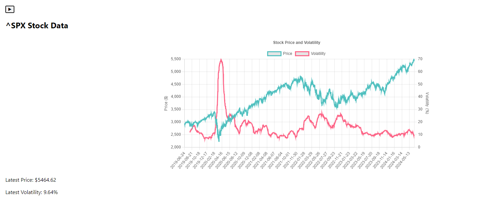
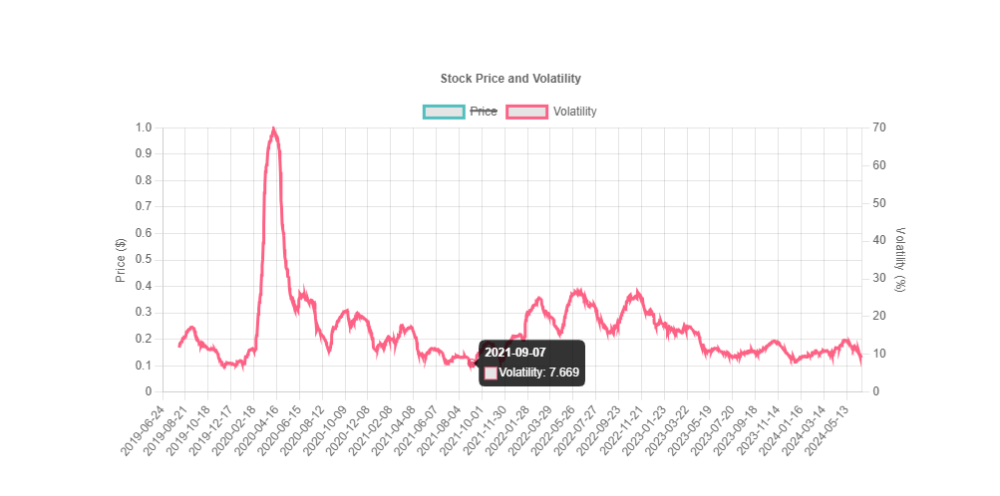

# About this project

- I wanted to see how realised volatility compares to implied volatility.
  But I see that realised volatility is a paid feature on most platforms for stock analysis.
- I use Yang-Zhang Estimator to calculate realised volatility.
- I use yfinance to get historical stock data. Accuracy of the data is dependent on the accuracy of yfinance.
    - Generally from what I've seen, the data is accurate for all the tickers I have used as they are major instruments.

## Available Scripts

In the project directory, you can run:

### `npm start`

Runs the app in the development mode.\
Open [http://localhost:3000](http://localhost:3000) to view it in the browser.

The page will reload if you make edits.\
You will also see any lint errors in the console.

### `npm test`

Launches the test runner in the interactive watch mode.\
See the section about [running tests](https://facebook.github.io/create-react-app/docs/running-tests) for more
information.

### `npm run build`

Builds the app for production to the `build` folder.\
It correctly bundles React in production mode and optimizes the build for the best performance.

The build is minified and the filenames include the hashes.\
Your app is ready to be deployed!

See the section about [deployment](https://facebook.github.io/create-react-app/docs/deployment) for more information.

### `npm run eject`

**Note: this is a one-way operation. Once you `eject`, you can’t go back!**

If you aren’t satisfied with the build tool and configuration choices, you can `eject` at any time. This command will
remove the single build dependency from your project.

Instead, it will copy all the configuration files and the transitive dependencies (webpack, Babel, ESLint, etc) right
into your project so you have full control over them. All of the commands except `eject` will still work, but they will
point to the copied scripts so you can tweak them. At this point you’re on your own.

You don’t have to ever use `eject`. The curated feature set is suitable for small and middle deployments, and you
shouldn’t feel obligated to use this feature. However we understand that this tool wouldn’t be useful if you couldn’t
customize it when you are ready for it.

# Backend

### `python app.py`

The backend will run on port 5000.
app.py will call yfinance and pass the dataframe to YangZhangEstimator.py to get the volatility series.
The series will be passed to the frontend as a json object.

**Note: I haven't actually tested these command. I just ran the backend and frontend by clicking start on Pycharm and
Webstorm.**

# Example usage

Select a symbol from one of the categories on the sidebar

Close the sidebar

Isolate a series by clicking on the legend

# Possible improvements

1. Add features for other types of strategies
    - Option pricing with BSM, extracting information like market implied risk-free rate from futures contracts
    - Dispersion trades
    - Dividend capture
    - Portfolio construction with options and stocks
2. Add more data
    - Include information like rolling beta, earnings date
3. Improve UX
    - Include feature to add Tickers to the sidebar
    - Change the design to make chart into a card. So that we can display multiple charts at once
4. Use SQLite to store data